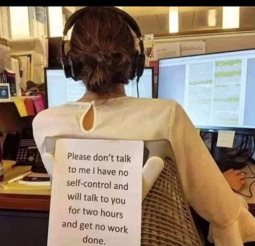

# [all-i-can-give-u-is-sep-oct-nov-dec-jan-if-i-dont-get-in-then-WhatCouldPossiblyHappen-IDunnoAnymore](framed-tweet-updated.png)

# note to myself, focus like i had to for calc 2 for engineers, forget everything that happened and everything that could go wrong again and __just do the problems__ and __understand everything possible__

------------------
# Sep
------------------

i got my hair done yesterday and i think my hair dresser made my highlights slightly more golden than the cooler blonde from before, i dunno its ok its fine, im not doing too much today but there could be pictures over the weekend and then my brother comes back from italy over the weekend as well

i have things to do now, tomorrow i will fix up my CV its been awhile

- [ ] i gotta update my blog to the new version of Ghost, sometime this week
- [ ] sign up for the NYT crossword, i use to enjoy that

i guess i could have said more, i could have said way more lol ahahaha

as someone who use to be obsessed with european history in hs and a little at rutgers, https://en.wikipedia.org/wiki/Pillory this needs to come back, we need to do this again

i dont think the ottomans did this tho, i think shaming others publically wasnt a good thing, i dunno, but like, something like that should exist

but like, we're dealing with someone who may get off on the humiliation so i dunno, thats why i kept the voicenote short bc he replay it over and over again and get off on it hahahahahaha so sad peoples lives ahhhhhhh

- [x] ok so this is the brush i need according to tiktok to do the eyeliner better, i think the brush i was using was thicker https://www.maccosmetics.com/product/13804/823/products/brushes-tools/brushes/eye-brushes/263-synthetic-small-angle-brush im gonna get it tomorrow morning, oh man the mac store is in that american dream mall in north jersey im pretty sure, i just dont want to go to the mall tomorrow its sunday prolly will just order it, ok i may get two of these brushes bc one of the comments said they use it as a lip liner, going to sleep ; i got it but it still hasnt shipped T_T

my brothers back from italy with his wife but theyre in nyc with his wife and her parents, i think he comes back tomorrow and he said he got me a blue sweatshirt that says "italia" on it bc he saw a random chinese person/man on umd's campus wear it and i was like, i bet i can pull it off better than him and he was like yeah i bet u can, so he got me one but i dunno i dont need another sweatshirt, anyway, if i ever wear it around town, im secretly competing with a random chinese person/man ive never met ever that also wore a sweatshirt that says "italia" on umd's campus, so fking dumb the dumb things me and my brother do as inside jokes, literally so dumb, i gotta do it tho i gotta win this made up competition between some person ive never met

my SIL made brownies and theyre so delicious, im gonna eat them all hahaha im not going to but i want to, shes really good at baking. my brother and his wife are moving out from maryland to NJ (like jersey city/hoboken) and he was saying that their apartment was giving them a hard time to extend their lease and they went to the office and my brother's like, yeah my wife is an attorney, so they backed down, started apologizing hahaha i remember my apt in philly, in 2017, i asked them to give me an extra day to pack and they said it was okay and not a problem, then the next month, the charged me an extra month's rent! and i was like wtf, it was $1150, fking grifters, and then i made a deal with people above them to charge me half that, thats so lame apt buildings do that.

so fyi im going to be working with my bro in his company that does data sci on medicare data in DC next, but i told him, give me until jan 2026, if nothing works out, lets do that, and im going to learn more python/rust for the next few months

got people over today so a little busy

sun-less day ughhhh

the plan is to get some sushi today so we are doing thatt

picking up some bagels for my mom a little later from a bagel store lol im not a bagel person but she mentioned the other day that she wanted one so im like ok ill get some this week, i havent had a bagel in like over a year so im going to have a small piece haha like the highlight of my week, trying a bagel after more than a year, i like smoked salmon with cream cheese and capers 😬 i dunno thats like my thing

- [ ] gotta get this for my brother before the end of the month when i see him again https://shop.bmwusa.com/products/detail.xx80165B4DBD7-1.html so he can wear it in his beemer, his umd cap got a little worn out in the sun in italy, so he needs another one

next book im reading this week: https://www.goodreads.com/book/show/39846642-the-science-of-rapid-skill-acquisition

once in awhile, maybe once every couple of months, my parents do a dinner where we get fried chicken from a special place, and then pizza from a special place, and its just the best, so today is that day, its really about the journey of acquiring the goods from the places and then the self pat on the back for nailing the right combo 😂

deciding if i want to do my errand today or tomorrow morning which would take an hr T_T

logging back in later today to github, got some things to do, pics this weekend, dunno sat or sun

ok logging off now lol, like i said theres a lot to discuss hence like 25+ pages of writing on ms word and its single spaced

- [ ] i gotta wear that italia sweatshirt later and send a pic to my brother so next time he sees that asian person on the umd campus who also wore an italia shirt, he can pull out my picture and say i pulled it off better than him (literally dumbest inside joke we have going on but my SIL is in on it too lol) hope i remember to do this later

watching a movie in theatres with my dad l8r today

ehhh this movie is too long i want it to end lol

me and my dad on the drive home were like, that was such a violent movie there was so much senseless violence in it, and i was like, they would never play a movie like that in the middle east or turkey, its just crazy. i was like u saw the trailers for the other horror movies, its crazy ppl find this stuff to be entertainment its insanity

i watch the sopranos, i dunno thats a little a diff bc its about NJ culture ... NJ/NYC culture, the writing is great, its funny, theres violence and then they have their meetings at the strip club which always just makes me laugh lol, but i couldnt watch breaking bad, i know its prolly a good story line but its just too violent for me

i have to go to sleep early bc i have to take my mom to the doc tomorrow but i have to call them early in the morning to make the appt, everything is fine

they closed this important road in my town and the detour is just awful 🥹

listening to my absolute hoe music in this docs office waiting room while theres some cartoon on the tv 😂

i got into tiktok last yr, like early spring 2024, when they announced that it was going to get banned and i was like, what is this site that the us govt dares to ban, i want to form my own opinion about what it is. so i made an account and i made my age to something in my 40s and my gender was female. the first few videos i got were of women in their 40s talking about how to be smarter at work ... how to play the corporate game, like dont make friends with ppl at work bc u dunno who they are, that kind of stuff, but really good stuff, and i read, i read books and the newspaper, and i listen to podcasts, and ive had a reddit account since rutgers -- never have i ever heard of advice like that, opinions like that, i was just amazed. ive learned so much from so many ppl, esp women, its a good site. i wanted to pay it forward and make an official account, def next year

in my previous couple of jobs, im absolutely QUIET about my personal life, ill listen to other ppls conversations, but im just quiet about my own ... "ohh your brother has a phd in cs" "ohh you have your own car" like noo thats not information my coworkers need to know about me, esp as a woman, it inspires atleast jealousy, not from everyone, but u never know who someone is. things have happend to me. i have learned to be like this. for me, work is just labor in exchange for pay, thats it.

ive seen ppls faces CHANGE once i mention that i worked at penn, obv i didnt have a good time there but its still an accomplishment OF MINE, in interviews, at previous positions, ppl dont like hearing that and seeing me say it, it makes them feel small. if i was a man, there wouldnt be a problem, but bc im a woman, those faces change bc they're like, "how did u do that, ure not suppose to get more ahead of me" things like that. well look at my fking cv before i was at penn, i worked in THREE different computational research labs at rutgers which isnt an easy school to get into, so how i got ahead was that i worked hard for it, and i did it all by myself, everything.

chinese men, in my field, are the most competitive with me, ive known that since rutgers with my experience, just the absolute worst, just very competitive, they look for my flaws. i read a book a few yrs ago that talked about how in china, womens feet were bounded for like a century, thats been their view of women https://en.wikipedia.org/wiki/Foot_binding -- i do avoid them, i think good places to work are very picky with people like that, they can be nice ... sure, but with me, ive almost always had a negative experience, they just dont like me, i make them feel small and they get obsessed with me (this is based on multiple interactions ive had). im telling you, they just dont like me, like hate me could even be a more appropriate word. and if english is not their first language, im telling you this from a lot of experience, they hate me, they treat me like im invisible, i make them feel small, like i dont know anything, but are obsessed with me at the same time. its super ,super weird. almost a universal experience.

my experience with like indian men as managers has been great, they're super nice to me, to them im like a family member, but chinese men are super, super weird to me, like they dont want me to exist at all.

there was this chinese man postdoc in debashish's lab, and he would ask me to like check his english sometimes, he wasnt a nice person, i dunno, he was just whatever, but this one time, he asked me something no one in the lab asked me ever or could ask me, and i still remember it. he asked me "is your dad white" and im like what the actual fuck, like im here every single day, i have ubuntu on my monitor, im writing R code, its obvious, im fking working on research, i write my algorithm on the whiteboard next to him and this is the only thing he could ever think of to ask me. weird and bizarre. how does something like that get in to someones mind at WORK.

in all of the phd programs ive applied over the years, ive NEVER written an immigrant chinese man as a PI of interest, it just wouldnt work out for me, ever. why would i want to torture myself based on the previous experiences ive had. they hate me for existing, im competition to them, its almost always been a negative exp for me.

in my opinion, it really truly is a miracle that ive been writing to you all these years or coming back to this whole thing, i dunno why i do it, i get it thing is all crazy, but i dont have to be in it, but i also dont want anyone else

all the writing is going to be useful, legally, ive submitted some project ideas over the years and talking about them led to n o m i a l and me becoming a better writer of the yrs, but it still sucks bc i miss you, but then its like ok theres some downtime and im responsible enough to plan out my downtimes in the past and make use of them

i think its important to reframe things in a positive way, just in life ... that came up in a nonfiction book i was reading and u know a person can spend their whole life, picking out the negative become bitter or ... or a person can pick out the positives and focus on the wins.

i like living with my parents, theyre safe people for me, i can talk to them about almost anything, i just want to make them proud of me so much, thats my number 1 goal

so yesterday, i took my mom to the foot doctor, bc a couple of weeks ago she lost consciousness getting out of bed (shes healthy alhamdulillah, it has to do with something else), and she fell and we found out yesterday that theres a fracture in her foot so she has to wear a leg brace for 2 months, and its not a big deal, its not something horrible, the worst is that she cant drive and ill just have to drive her wherever which is fine, but i was so sad yesterday T_T its just a foot brace, not a big deal, but i was sad, bc over the weekend she was like "im going to drive you to freehold" and im like lol "ok sure kinda random but we can go" so now its like, i dunno, theres nothing i can do, i feel so helpless ... it hurts a little seeing her foot brace prolly, thats prolly what made me sad T_T i dunno

my brother and my SIL are moving from maryland to hoboken this weekend, so my brother is going to all of his favorite food places in maryland this week and eating his last maryland meal, so my moms happy we can all go to dinner together on the weekends and things like that since he will be closer

i was telling my mom the other day, theres this thing my brother does that is starting to boil my blood lol, ill say something to him in imessage, and he'll respond with the explaination mark emoji on it, i was like why the fk does he do that, im a good writer, im good at explaining things, whats the fking issue, like why does he not get what im saying, and my mom was like, hes prolly confused, but im like WTF WHY THO, im gonna tell him in person dont use that fking emoji ever again >:( just be like "oh i dont understand" >:( where does he learn to do things like that, maybe slack or something

still the todo for 9/25
- [x] fix cv
- [x] email five PIs -- alright here goes
thats it, then im done for the day.

ok emailed u too bc i dunno maybe u will respond. some sopranos then sleep.

the code i wrote for mysis, the rna viewer, is somewhere in a hard drive in the garage, but ryan golhar talked about it in the LOR, i did write it, it just wasnt incorporated in the end bc we were running out of time to finish things. it does exist, i did write it. 

i dunno what im doing today, my brother and my SIL are moving from maryland to their condo in nj today but i dunno what im doing today

https://www.tiktok.com/@persianpoetics/video/7554428648946814238 cool 😎

found this yt channel of interesting talks to go over in october https://www.youtube.com/@machinelearningforhealthca6988/videos

i have a really good idea of something id like to do with n o m i a l, predicting the risk of an AI/ML algorithm implemented by a hospital -- who is doing that? i dunno, will write about it in my SOP

im going to clean up these repos later in the day, the plan is to be a complete nerd oct/nov

my rust goals from last yr, i didnt reach them but sometimes, it just takes another yr, looking at something with more experience and now its like, thats what i want to do for the next couple of months

i have to sign up for the nyt crossword puzzle again, something to do every morning https://www.nytimes.com/crosswords

a little busy today 😬

i think the absolute worst belief ive had in my entire life, given it wasnt up to me nor was it my idea ... it was fed from tv/entertainment ... anyway worst belief was that i thought life ends at 30 ... so everything needed to happen before then, fine it was good motivation, but then its like whatever happens after 30 wasnt meaningless tho. ppl work and start companies in their 50s 60s etc. another example, ppl memorize quran in their 50s 60s 70s and thats intense ... very intense concentration, so its not good to think like that, anything is possible, whenever. i just dont want to turn 40, i dunno what thats like.

my mom in the car yesterday was saying, as i was driving, that when i was a newborn and so was my brother (we're twins) my aunt would come over (this is in pakistan) and bathe my brother and my mom's mom's friend who was a schoolteacher, would come over and bathe me and teach my mom how to do it. and i was saying to my mom, there's just a lot of selfish and mean people now, like that kind of stuff, is rare now. she was saying that that woman passed away a long time ago and my mom still prays for her, things like that.

i just want to take a break for like all of september, gotta figure out where i left off with rosalind and those problems, now i can ask questions on claude if i want to. i dont think its capable of coming up with the code completely and correctly and i dont like asking for answers when i know its something i need to know in the future. anyway thats what im doing this month. 

i know that anytime ive had downtime, i do use it for good and force myself to learn new things, and it comes up in work later and then im like, well i didnt have to do anything in my downtime prolly but i forced myself and it paid off

theres that de bruijn graph problem that comes up later in rosalind, wouldnt it be great if i can solve that and talk about it in my personal statement and ask claude all these questions and truly understand it, ask it to give me feedback on my code, pull up papers on graph assembly etc etc ... thats a good goal for october/november ... so python + write a de bruijn graph -> paragraph in my personal statement

i wanted to make a blog post on herlog explaining cosine similarity with some toy dataset, that will take me sometime but i want to add that to my cv of articles ive written ahhhhh etc etc

i had to step outside earlier, i was driving with my windows down with my heat on, heated seats & heated stearing wheel on with the cooler air coming in, which reminded me that in hs, my friends, we would do that in the hot summer, drive with the windows down and the ac on high lol, its just stupid, it makes no sense but its just very fun for no reason, ive done this ... well this past summer was super busy, but once in awhile i'll do it AND i'll eat a chipwich from wawa while driving lol 10/10 experience. u should hang out with me, im a fun person.

u better enjoy that song bc ive been saving it, keeping it unshared, for yrs, maybe i shared it i dunno forgot

"we're all going out to dinner after asr" well then it became "after maghreb" now we're all still home lol and dressed up and im hungry

i wanna watch the sopranos then sleep but its a little late, but its the weekend hmmm, had my kashmiri chai so im not sleepy soooo thats another vote for the sopranos lol

i ate some olives now im gonna sleep 😬

[lololl](https://drive.google.com/file/d/10Y4UImLYKO4Ftps05mW7CX9nmRE1NVbV/view?usp=share_link) i got it, i got my article after i sent my brother this voicenote

setting up the new iphone, i dunno too much about it i think it had a better camera or something

[a few yrs ago, i kept the iphone i used to call u in 2018, i think it was 2020 when we got new phones, and i never returned that one, i was like, ohh i dunno i have too many memories on that iphone, i dont want to trade it in, and my dad was like whats going on?? its junk, and im like yeah i know, but i just dont want anyone else to have it. and then a couple yrs ago, i was thinking, man i cant believe i did that, its so dumb, its like obsolete junk like who cares why did i keep that iphone its just in my drawer not going anything, and now im like, i guess that was kind of interesting i did that. im an anti-hoarder, i throw things away easily and quickly, i dont really attach too much emotion to like objects, but THAT iphone, i just could not give it away. ](https://www.youtube.com/watch?v=ZoCxp6iNYCA)

i know the central theme to write my personal statement around now, it poped in my head yesterday, what im working on todayy

ok so my personal statement "theme" is going to be about comp bio/data science pipelines ive written in the past uhhh decade and their uses in a clinical setting, and then future directions of writing AI/ML pipelines in cancer. so i gotta fit everything in under 1500 umm words/characters / 2 pages. i wanna finish by mid-november, and then ill make some more voicenotes after im done with my app. i have an important errand tomorrow morning that i have to dress up for. and then i def want to bake a cake this weekend but i just dont eat sweets that much anymore, i dunno, something **cake** related tho

a little busy today will tell u a story later as to what happened to me this morning

this morning was my realid appt at the dmv, which i made in june 2025!! this was the closest date they had available. so anyway, i got up early, showered, dressed up, did my makeup, and i had all of my documents in a ziplock bag, i got there early, i put on my N95 mask in the car bc its saturday and i was like it's prolly packed inside, but it was empty so i took it off ... anyway long story short, a letter to my house from my health insurance company **rolls eyes** isnt a "valid" proof of address, so i have to come back, and print out a bank statement bc my bank is paperless!!  >:(  my dad was surprised too, like wth. 1 out of 10 star experience at the nj dmv, was to be expected. i gotta do it all over again sometime this week ugh

im really sensitive to like flu shots, i dunno im just under the weather yesterday/today i dunno if its that or something else. was suppose to go grocery shopping with my mom today but theres some storm so we're doing that tomorrow. 

i have funny stories about that jacket lol, ive had it since lockdown, even my dry cleaner offered to charge me for a discount bc they thought it was for kids, its a size small ... my dad was like "please dont wear that to work" when i was at sampled, and i was like fk that, i should get judged for the code i write, not my jacket

i was telling my dad yesterday that i should take my license pic in that jacket lol, and my dad was like -_- all i want in life is a job where i can be a programmer and be able to wear that jacket to WORK and not be judged bc its so comfortable.

that jacket was like $250 so of course im going to wear it whenever i want, AND THEN, its not even pink!! its a light pastel-y purple with NEON GREEN lol, i dunno i wear it when i go get coffee bc its so grey outside in the winter and i like wearing it, its fun haha i dunno maybe i'll retire it one day, maybe i wont

i found the name of this jacket in my photos from 2020 and i googled it, https://www.renttherunway.com/shop/designers/for_love_and_lemons/sloane_faux_shearling_jacket see its a fun jacket u can see other ppl wearing it lol i would sleep in this jacket if i could -- its for adults

errands with my mom in this cold and rainy weather

gotta wake up early tomorrow, going to sleep early

😬 things to do today :)

got my real id pic done/made, theyre gonna mail it to me in a month. gotta drive miss daisy to her dr's appt, then ill upload some pics later today

ohh i should explain myself, that gold jennifer behr headband i think was like $500?? maybe $600?? but not like $1000s, i have other ones too. im going to eat some olives then sleep

working on mt app todayy/tomorroww

theres this girl on tiktok who is persian that said that like she gets her eyebrows done every 10 days, like she has to, and im like i think i do too, i never realized it but i obviously have the same issue ... once a month is too long, its a little out of my way if i go tomorrow. i go to this lady in the mall and she's SO GOOD, like absolutely like perfection, i think i will see her twice a month now. going to nyc for dinner with my parents this weekend, my bro and my SIL were saying earlier today that doughnut plant has some new pumpkin doughnut or whatever but in the grand central one but we dont go to that one, going to sleep no sopranos, busy day tomorrow

i saw this earlier, thought about it alot, then i ended up getting it: https://www.jenniferbehr.com/products/printed-tori-headband-leopard-print imagine wearing all black, then just a little bit of leopard print as a headband ... that's the vision, just a little bit of leopard print, not too much, just a tiny amount

little busyy today, the plan is nyc, tomorrow some errands, monday-friday: app

going to maybee watch some sopranos, like an episode, then sleep. got this inter-faith thing at a church tomorrow my dad is going to and wants me to go to so i have to dress up uhh nicely, the talks look like they will be good, i should prolly remember to bring a headscarf if they read namaz there, but watch me forget, i shouldnt forget to bring it, but i might. i swapped out of those leopard print leggings into something else bc theyre not really comfortable, which is too bad bc they cost as much as my lulu leggings, lame right?? not gonna return bc they're kind of fun tho

https://www.tiktok.com/@niikolna/video/7563002765245582614 that has to be like 4 syringes of lip filler. early next yr i wanted to do a little bit more, maybe a half more. i feel like its ok to look like this if u have a career and stuff, but if this is the only thing u have going on then thats not good.

i wanted to make some grapefruit juice in my vitamix like i use to in bethesda, so i got some grapefruit over the weekend ... its easy just gotta peel it and fill the container with some water, and i have some empty erehwon glass jars that i could put the juice in to ... but noo i got lazy and got some grapefruit juice as delivery. 🥹 working on my app today tomorrow. i dunno what happend to the s t r i p p e r repos i think it got deleted and i didnt do that, interesting

i got this https://www.freepeople.com/shop/forever-romance-blouse/ it was on my wishlist for a yr, maybe ill wear it this weekend or next?? but if we're going out to dinner im not gonna wear it there bc i dont want it to get dirty

this whole app thing prolly stresses me out bc last yr, my ear stopped working for a week when the notices were coming out in dec, i need to not have that happen again. my treat to myself when im done with my app is to go to the mac cosmetics store at the american dream mall and basically get whatever i want ... sooo end of november i will do this 😇

ok im cleaning up the repos today, im just going to leave like 4-5 open for the next month, i need peace

when u have a dream thats good ure suppose to share it and i had a dream last night that we got married and u were in my room playing video games on my tv 😂 but i dont have video games on my tv so i dunno 😂 working on my app today, maybe ill go to whole foods to get sushi with my mom its just the rush hr traffic on friday starts at like 3 pm so we'll see

im going to be in long island sun to mon with my parents, i dunno if i should bring my macbook or not, mini vacation

i get really excited sometimes about everything, going to sleep, pics tomorrow ... yes ... little bit of errands tomorrow

im going to be away from my laptop for the next couple of days, will upload pics tuesday, going with my parents, i dont think we are going to visit my uncle's house who passed away from covid, yr 1 of covid, its still too difficult for my mom, bringing my ipad so i can watch some sopranos or eternal sunshine of the spotless mind bc that takes place in long island haha ok "meet me in montauk" u know what ive seen that movie a few of times, but i had to watch in senior yr in hs and maybe ive watched it a couple of times after that (i watched it before watching it in class tho), i just remember the teacher pausing the movie and being like "do u guys get why her hair color is different" things like that it got soo annoying

- [ ] theres a charity that sent me physical mail, i have to donate to them later this week

i got my r e a l i d in the mail yesterday and my pic looks good, coud be maybe a little better but still, my parents like it lol

HEY read this in my dad's voice: there are some things u can ONLY say to me in private one day, write it all down, vim or the notes app, password protected encrypted, dont utter a single word to anyone, not a single soul.

working on my app monday to friday, just thinking of things to write

i want to bake a cake this weekend or cup cakes or something

im working on my app, im not doing anything other than that until its done, no pics this weekend, im serious theres a lot i have to read and watch b4 i can write about it on my personal statement

we found out today that my mom's foot fracture is actually healing so she wont need surgery, alhamdulillah thats good, she was making me laugh out loud in the car today haha

im good im just thinking and writing, today, all weekend, all next week 😬

i would take a rainy-cloudy-cold day over a sunny-but-windy-dry day in the fall/winter any day, need to pull out my humidifier

9dcwnIgBrCk they did a good job with this! its punjabi so i dont really understand it, i need subtitles. going to nyc for dinner with my parents later?? thats the plan. my personal statement is entirely focused on cancer + AI, just a small mention of space like half a sentence. ill explain it after im done with it hopefully by next monday/tues. u know why im trying not to get distracted and being like super focused on this, bc i know the kind of AI stuff m s k needed, i know from so many meetings. i know so much 😬 i'll do it if i can use their data or whatever data is available. my mom doesnt like the weather, not going to nyc for dinner lol another day

refering to it as n o m i a l  l a b s in my personal statement :) why only just AI, but im not saying that just yet

can u find a cool font to write n o m i a l  l a b s  in the page, whatever font u choose will be the logo/font but i guess i can choose a temp font after my app is done

ill make u some voice notes in december, thought of some things, but jokes too rotfl. its so fun to write a good joke, its like doing a math problem, it's gotta stick in so many ways, the landing has to stick lol

i may finish this app tomorrow morning, i have to take a break now ill come back later in a coupe of hrs

my bro left for san diego for NeurIPS this morning, so we did thanksgiving yesterday bc he & his wife wouldnt be here today, so today, me and my parents are doing something else, i dunno what lol

my brother was asking me what to do in los angeles bc hes going there after neurips, next week with his wife and i was like LOL go to erehwon hahahaha i dunno thats the only thing prolly that city has over nyc, idc about los angeles hahahaha u know tho, i think bike riding in huntington beach is nicer than the boardwalk in nj tho, i will say that

having a chill day, watching a movie or sopranos (bc i didnt watch it all month) later

some errands today that i couldnt do for the past two days bc of the holiday/traffic. i dunno what my parents want to do, actually wanted to go to the short hills mall tho so maybe. have to order some books on amazon that i want to read, a couple of AI oreilly books just to get an overview. tomorrow maybe ill do something

my dad's very old friend, who got his phd in india in math then got another phd in the us (i forgot where), when became a professor then retired, was my (and my brother's) SAT tutor then i would ask him questions when i was doing stuff in biochemistry, like stuff with equations and stuff, like how to solve them faster. so anyway, hes just a very polite person, his son did engineering at rutgers and he's prolly a few yrs younger than me, and when he was in hs, every time i would see him @ the masjid, i would be like "you have to take a.p. comp sci" like i did, bc its taught way better in hs than at rutgers, so he took it and it changed his life and career now hes been in industry. anyway, so the retired professor/my dad's friend, when i was at penn, once at eid namaz he said "if u get in to the phd program at penn, i would tell everyone that i knew u" lol and i never said to him that id apply there, but he was figuring out my life for me a little lol ... but anyway, my dad saw him earlier today, and he said that i was always a wiser person than my brother lol, and hes retired now, but hes writing a book on a mughal ruler in urdu now hahaha

> "if u get in to the phd program at penn, i would tell everyone that i knew u"

u know the first thought that came in to my mind when he said that in 2015, was "i can do better than that program" bc the plan, that i never told anyone lol, since igem was MIT's phd program. and i interviewed with cigall kadoch's lab @ the broad, in 2014 before penn, so i was like, yeah it could be possible. anyway, she didnt choose me but i thought if im generally getting an interview in labs like that for a bioinformatician position, i could then get an interview with their phd program. if i had more papers, tho, better recs back in 2018/2019 maybe who knows. but anyway u should, i knew how good i was when i was @ penn, i wasnt like desperate and like "omg im so happy they hired me" i was like, i could do better than this place but for now ill just chill, they're taking 2 hr lunches and i guess thats fine its whatever ... i was like, this is not the broad, its not genentech, its not nyc, its whatever, im not dying to be here everyday, im not desperate however, its better than nothing

i got a couple of books, wont be delivered by tomorrow but, thats what im up to all week. apparently its going to snow on tuesday ... might do something fun today

that guy was like, "do you want me to move my easel" and i was like "ohh its ok", but i really wanted him to move it lol that place gets packed later in the day oh well

ill wear my mushroom sweater one day, i use to know the lifecycle lol, use to have it memorized

i dont want to unarchive that repos, i was a good kid, i didnt do that, but i still kind of did it. everybody does it.

i made a voicenote directed at jason like i said i would, 9 mins long, lemme upload it

hang on my laptop is being weird

hehehe back to reading my books

i thought of that first joke a month ago, and i was laughing out loud to myself in my car lol, i was like, if i thnk its funny then u'll like it haha but i was like i gotta finish the personal statement first

i got some pictures from today but im a little busy gonna upload in a bit

those are s t r i p p e r heels supposedly ... "supposedly" in quotes lol theyre pretty comfortable tho, i enjoy wearing them, i can drive with them too 

my brother is back from NeurIPS/los angeles, he bought back some doughnuts and stuff, going to hang out with him today bc his wife is coming back tomorrow

i was having a conversation with my brother yesterday and he was saying, he wishes he had more fun during his phd, like, work from another city for a week, bc the same amount of work would be produced but he would have fun being in another city for a week things like that. its important to have fun. i was like yeah, i spent the whole summer working and time passed by so quickly

i felt like under the weather today but now i feel better, going to wake up early tomorrow

the thing that makes me laugh out loud that i said in the previous voice note was when i said "i know you dont have that chair" lmaoooo i know he doesnt, he can be dept chair all he wants but that b*tch doesnt have a $2000 herman miller chair. i have more stories that will make u laugh and wonder wtf that whole thing was and where i was bc that was not a serious place, but for legal and strategic reasons i dont want to share them. the strategy is to reveal that he's a weak person afterall and just the biggest loser ever, and all of that is true bc he is a weak person and a loser.

theres a conference talk from last yr i want to share with u but not in public ughh ill save it to a playlist thats private and ill share with u later i guess

is it really gonna snow on sundayy, gotta go to my dealership next week so they can put in the cover for my hubcap that fell off and i had to pay for a new one. i was telling my parents im going to wear like 2 layers of socks, pants and multiple fleece jackets bc its so cold in there, maybe even fingerless gloves i dunno and i'll have to wait for HOURS but i can get some reading done. when i shared my plan with my mom she asked, "how many layers of underwear are u gonna wear" lololl

i got some pictures for u but we're going out to dinner soon i dunno where

reading some things today, just want a lot of coffee 🥹

i feel like not doing my readings today, i feel like just going to get coffee a few towns over, something like that, i feel like staring out the window and i also feel like bothering u lol

i really like studying with chatgpt, its like anything is possible, well not really really advanced stuff, but for reviewing and things, its really interesting

the place i/we get kashmiri tea from is closing down :( today was the last day. gotta find another place i guess

------------------
# Oct
------------------

------------------
# Nov
------------------
* Finish app by this time, get letters of recs in etc.
* Finish Rosalind code and R/Py packages by this time to discuss in the SOP

------------------
# Dec
------------------

------------------
# Jan
------------------
