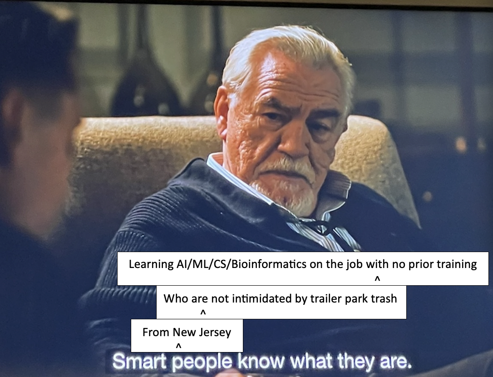
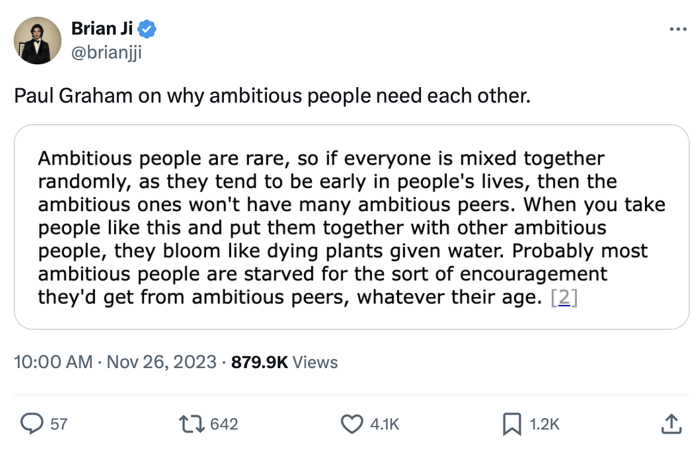
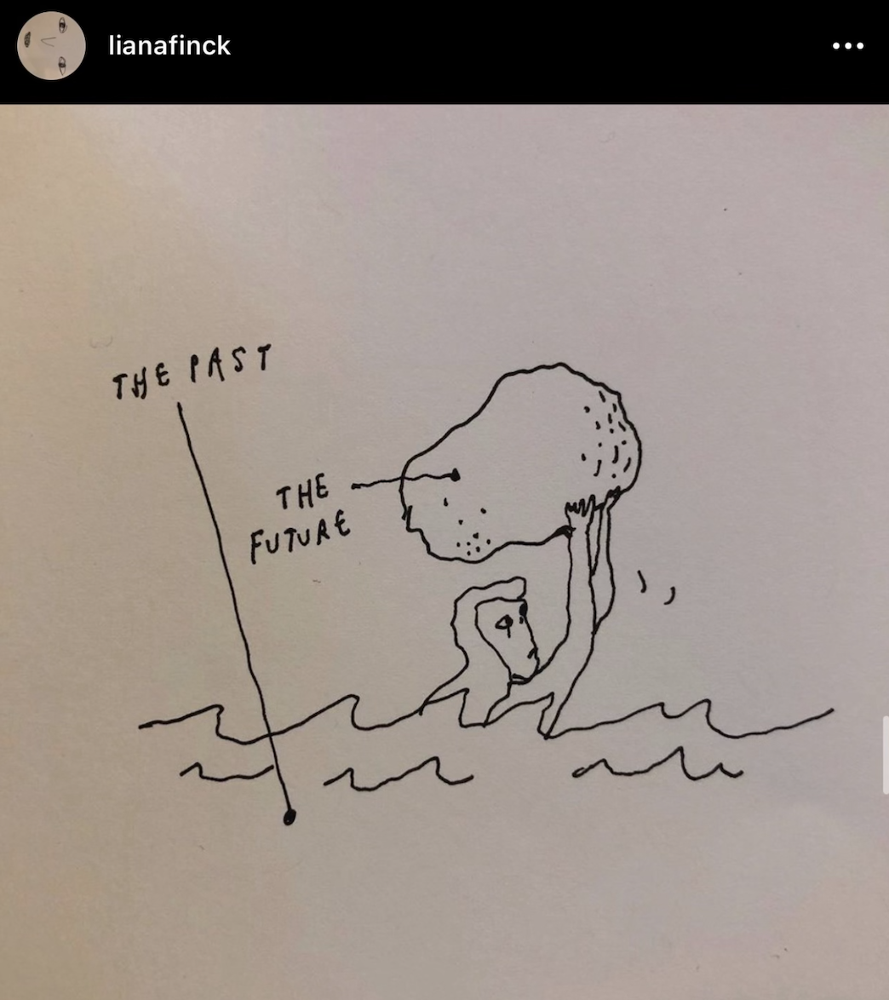
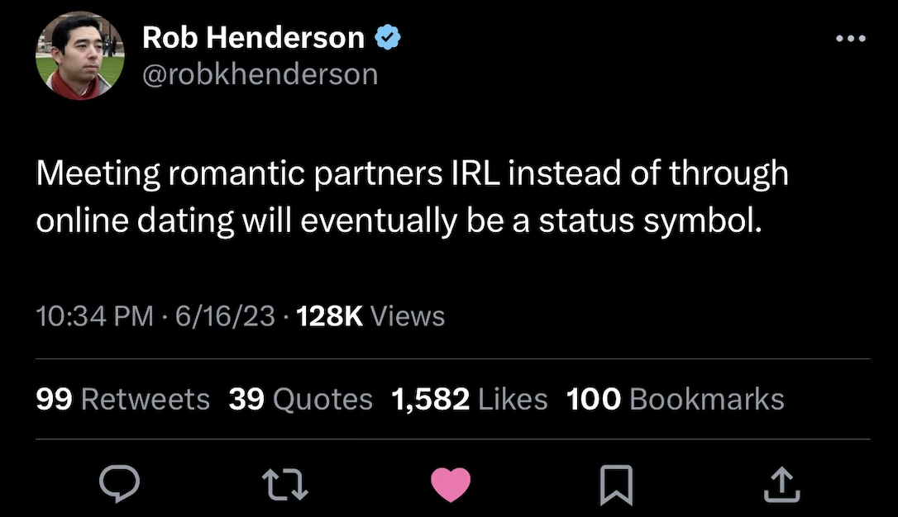
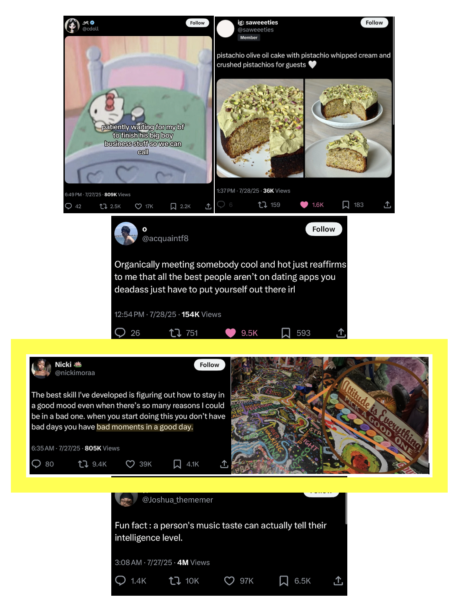
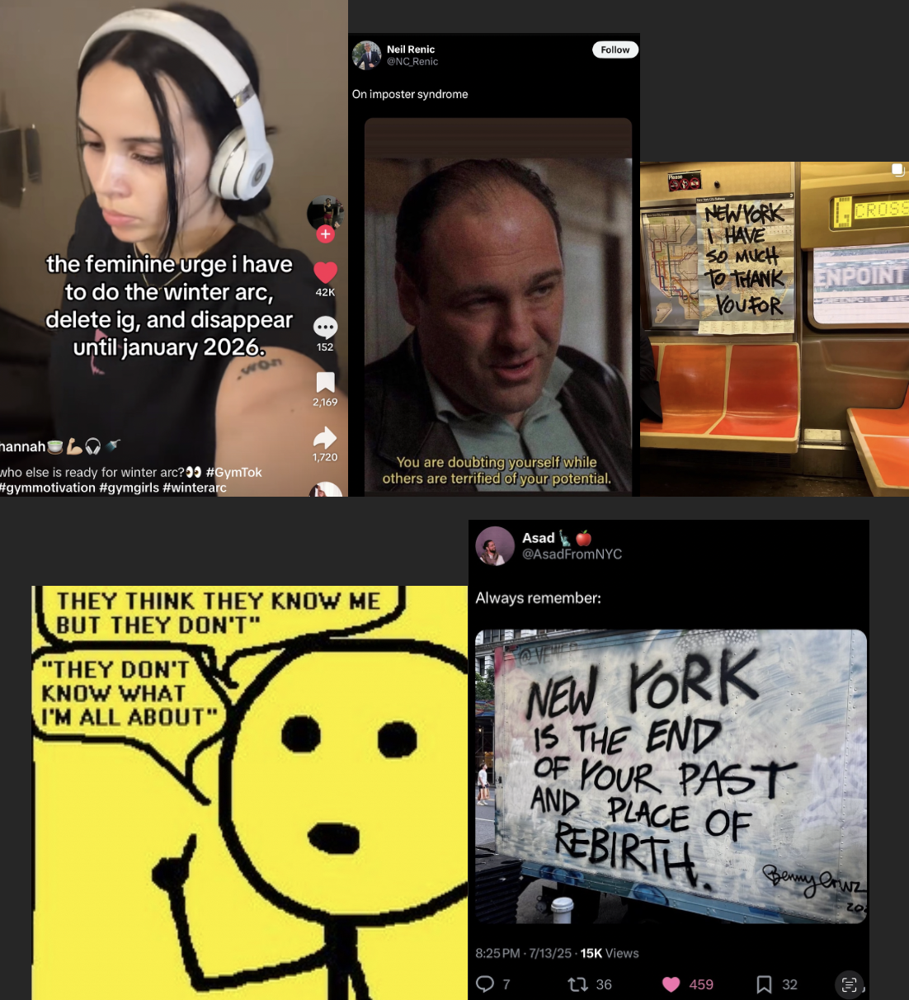

# all-i-can-give-u-is-sep-oct-nov-dec-jan-if-i-dont-get-in-then-WhatCouldPossiblyHappen-IDunnoAnymore

# note to myself, focus like i had to for calc 2 for engineers, forget everything that happened and everything that could go wrong again and __just do the problems__ and __understand everything possible__

------------------
# Sep
------------------

i got my hair done yesterday and i think my hair dresser made my highlights slightly more golden than the cooler blonde from before, i dunno its ok its fine, im not doing too much today but there could be pictures over the weekend and then my brother comes back from italy over the weekend as well

i have things to do now, tomorrow i will fix up my CV its been awhile

- [ ] i gotta update my blog to the new version of Ghost, sometime this week
- [ ] sign up for the NYT crossword, i use to enjoy that

i guess i could have said more, i could have said way more lol ahahaha

as someone who use to be obsessed with european history in hs and a little at rutgers, https://en.wikipedia.org/wiki/Pillory this needs to come back, we need to do this again

i dont think the ottomans did this tho, i think shaming others publically wasnt a good thing, i dunno, but like, something like that should exist

but like, we're dealing with someone who may get off on the humiliation so i dunno, thats why i kept the voicenote short bc he replay it over and over again and get off on it hahahahahaha so sad peoples lives ahhhhhhh

- [x] ok so this is the brush i need according to tiktok to do the eyeliner better, i think the brush i was using was thicker https://www.maccosmetics.com/product/13804/823/products/brushes-tools/brushes/eye-brushes/263-synthetic-small-angle-brush im gonna get it tomorrow morning, oh man the mac store is in that american dream mall in north jersey im pretty sure, i just dont want to go to the mall tomorrow its sunday prolly will just order it, ok i may get two of these brushes bc one of the comments said they use it as a lip liner, going to sleep ; i got it but it still hasnt shipped T_T

my brothers back from italy with his wife but theyre in nyc with his wife and her parents, i think he comes back tomorrow and he said he got me a blue sweatshirt that says "italia" on it bc he saw a random chinese person/man on umd's campus wear it and i was like, i bet i can pull it off better than him and he was like yeah i bet u can, so he got me one but i dunno i dont need another sweatshirt, anyway, if i ever wear it around town, im secretly competing with a random chinese person/man ive never met ever that also wore a sweatshirt that says "italia" on umd's campus, so fking dumb the dumb things me and my brother do as inside jokes, literally so dumb, i gotta do it tho i gotta win this made up competition between some person ive never met

my SIL made brownies and theyre so delicious, im gonna eat them all hahaha im not going to but i want to, shes really good at baking. my brother and his wife are moving out from maryland to NJ (like jersey city/hoboken) and he was saying that their apartment was giving them a hard time to extend their lease and they went to the office and my brother's like, yeah my wife is an attorney, so they backed down, started apologizing hahaha i remember my apt in philly, in 2017, i asked them to give me an extra day to pack and they said it was okay and not a problem, then the next month, the charged me an extra month's rent! and i was like wtf, it was $1150, fking grifters, and then i made a deal with people above them to charge me half that, thats so lame apt buildings do that.

so fyi im going to be working with my bro in his company that does data sci on medicare data in DC next, but i told him, give me until jan 2026, if nothing works out, lets do that, and im going to learn more python/rust for the next few months

got people over today so a little busy

sun-less day ughhhh

the plan is to get some sushi today so we are doing thatt

picking up some bagels for my mom a little later from a bagel store lol im not a bagel person but she mentioned the other day that she wanted one so im like ok ill get some this week, i havent had a bagel in like over a year so im going to have a small piece haha like the highlight of my week, trying a bagel after more than a year, i like smoked salmon with cream cheese and capers 😬 i dunno thats like my thing

- [ ] gotta get this for my brother before the end of the month when i see him again https://shop.bmwusa.com/products/detail.xx80165B4DBD7-1.html so he can wear it in his beemer, his umd cap got a little worn out in the sun in italy, so he needs another one

next book im reading this week: https://www.goodreads.com/book/show/39846642-the-science-of-rapid-skill-acquisition

once in awhile, maybe once every couple of months, my parents do a dinner where we get fried chicken from a special place, and then pizza from a special place, and its just the best, so today is that day, its really about the journey of acquiring the goods from the places and then the self pat on the back for nailing the right combo 😂

deciding if i want to do my errand today or tomorrow morning which would take an hr T_T

logging back in later today to github, got some things to do, pics this weekend, dunno sat or sun

ok logging off now lol, like i said theres a lot to discuss hence like 25+ pages of writing on ms word and its single spaced

- [ ] i gotta wear that italia sweatshirt later and send a pic to my brother so next time he sees that asian person on the umd campus who also wore an italia shirt, he can pull out my picture and say i pulled it off better than him (literally dumbest inside joke we have going on but my SIL is in on it too lol) hope i remember to do this later

watching a movie in theatres with my dad l8r today

------------------
# Oct
------------------

------------------
# Nov
------------------
* Finish app by this time, get letters of recs in etc.
* Finish Rosalind code and R/Py packages by this time to discuss in the SOP

------------------
# Dec
------------------

------------------
# Jan
------------------
